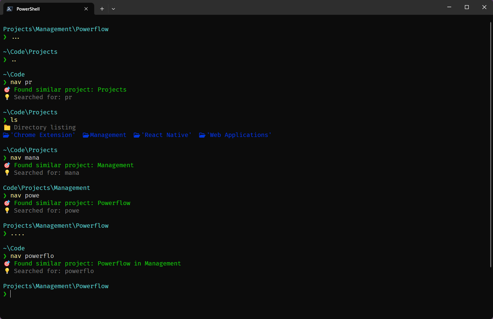
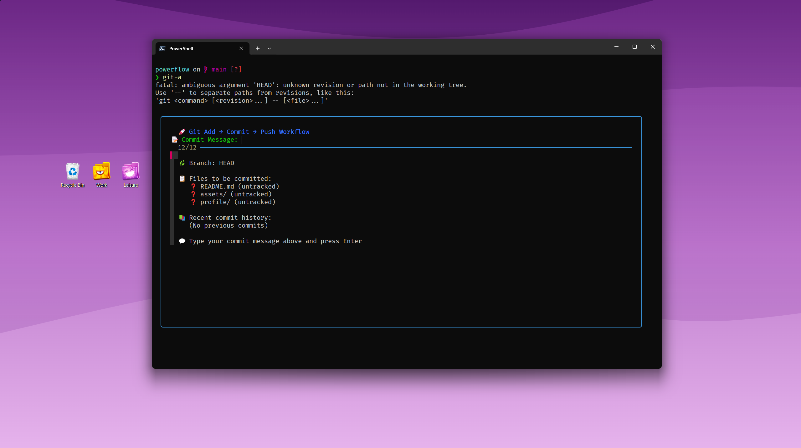
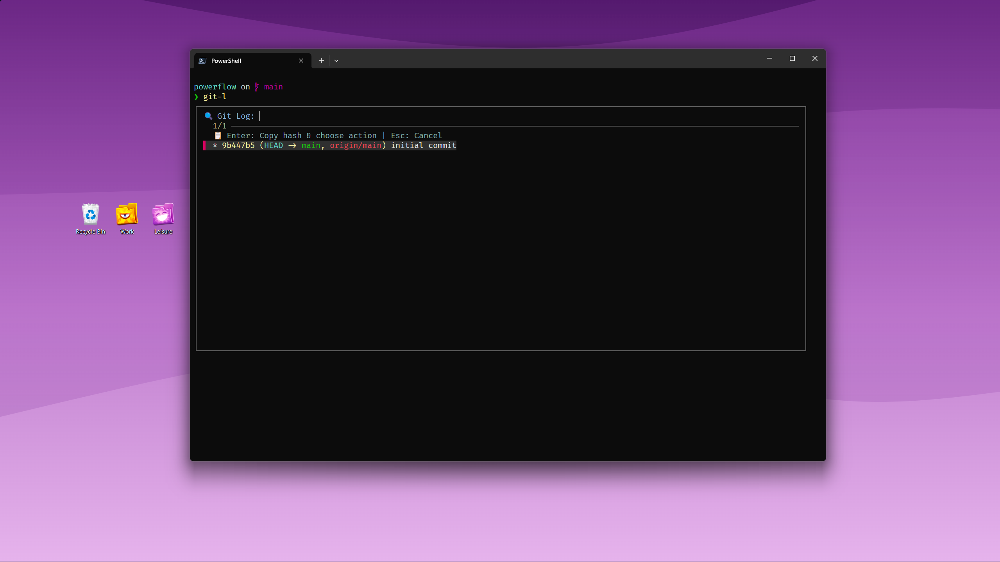

# 🚀 PowerFlow

> A beautiful, intelligent PowerShell profile that supercharges your terminal experience with smart navigation, enhanced Git workflows, and productivity-focused tools.

[](https://github.com/Syntax-Read3r/powerflow/releases)
[](https://github.com/PowerShell/PowerShell)
[](https://github.com/microsoft/terminal)
[](LICENSE)

## 🎬 Demo

<div align="center">

### See PowerFlow in Action!

<!-- Upload demo-video.mp4 to GitHub Issues to get the CDN link, then replace this line: -->
<!-- https://github.com/Syntax-Read3r/powerflow/assets/USER_ID/VIDEO_ID.mp4 -->



### Feature Screenshots

 

_🎥 **Full video demo**: Upload `assets/demo-video.mp4` to a GitHub issue to get the embeddable link_

</div>

## ✨ Features

### 🧭 Smart Navigation System

- **Intelligent Project Search**: `nav chess-guru` finds projects across multiple directories
- **Persistent Bookmarks**: Create, manage, and navigate to frequently used locations
- **Fuzzy Search Integration**: Beautiful fzf interfaces for everything
- **Context-Aware Navigation**: Adapts based on your current location

### 🎯 Enhanced Git Workflow

- **Beautiful Add-Commit-Push**: Interactive workflow with visual feedback
- **Rollback System**: Create rollback branches from any commit safely
- **Interactive Branch Manager**: Pick, create, delete branches with visual interface
- **GitHub Integration**: Browse, clone, and manage your repositories with token security

### ✂️ Cut-and-Paste File Operations

- **Smart File Moving**: `mv filename` cuts files, `mv-t` pastes anywhere
- **Fuzzy File Search**: Find files with partial names and patterns
- **Interactive Rename**: Beautiful interface for renaming files
- **Safety Checks**: Prevents accidental deletion and data loss

### 🎨 Beautiful Interface

- **FiraCode Nerd Font**: Auto-installed for perfect icon display
- **Starship Prompt**: Cross-shell prompt with Git integration
- **Color-Coded Output**: Consistent visual feedback throughout
- **Auto-Update System**: Keeps PowerFlow current with latest features

### 🪟 Terminal Enhancement

- **Tab Management**: Create, switch, and close Windows Terminal tabs
- **Auto-Dependency Management**: Automatically installs required tools
- **Comprehensive Help**: Built-in documentation system
- **Performance Optimized**: Fast loading with smart caching

## 💻 Code Examples

```powershell
# Smart navigation - finds projects intelligently
nav my-react-app

# Enhanced Git workflow
git-a  # Beautiful add → commit → push interface

# Cut and paste files
mv important-file    # Cuts file
# Navigate to destination
mv-t                 # Pastes file

# Interactive Git log
git-l               # Beautiful log viewer with actions

# GitHub repo browser
gh-l                # Browse your repos with activity stats

# Check for updates
powerflow-update    # Built-in update system
```

## ⚡ Quick Installation

### One-Line Install (Recommended)

```powershell
irm https://raw.githubusercontent.com/Syntax-Read3r/powerflow/main/install.ps1 | iex
```

That's it! PowerFlow will:
- ✅ Install all dependencies automatically
- ✅ Configure FiraCode Nerd Font
- ✅ Set up bookmarks and navigation
- ✅ Enable auto-updates
- ✅ Provide helpful setup guidance

### Alternative Installation

```powershell
# Download and run install script
Invoke-RestMethod -Uri "https://raw.githubusercontent.com/Syntax-Read3r/powerflow/main/install.ps1" -OutFile "install.ps1"
.\install.ps1
```

### Manual Installation

```powershell
# 1. Create profile directory if needed
$profileDir = Split-Path $PROFILE -Parent
if (-not (Test-Path $profileDir)) { New-Item -ItemType Directory -Path $profileDir -Force }

# 2. Download PowerFlow profile
Invoke-RestMethod -Uri "https://raw.githubusercontent.com/Syntax-Read3r/powerflow/main/Microsoft.PowerShell_profile.ps1" -OutFile $PROFILE

# 3. Reload profile
. $PROFILE
```

### Prerequisites

- **PowerShell 5.1+** (PowerShell 7+ recommended)
- **Windows 10/11** or Windows Server 2016+
- **Internet connection** (for automatic dependency installation)

**📖 [Complete Installation Guide](docs/installation.md)** - Detailed instructions, troubleshooting, and advanced options

## 🚀 What Happens After Installation?

PowerFlow automatically sets up your environment:

1. **🎨 Installs FiraCode Nerd Font** - For beautiful icons and symbols
2. **📦 Installs Dependencies** - Starship, fzf, zoxide, lsd via Scoop
3. **🔖 Creates Default Bookmarks** - Quick access to common directories
4. **🔄 Enables Auto-Updates** - Stay current with latest features
5. **💡 Shows Setup Tips** - Guides you through Windows Terminal configuration

### Final Setup Step

**Configure Windows Terminal Font:**
1. Open Windows Terminal → Settings (`Ctrl+,`)
2. Go to your PowerShell profile → Appearance
3. Set **Font face** to `FiraCode Nerd Font`
4. Restart terminal and enjoy! 🎉

## 🎯 Quick Start Guide

### Navigation Basics

```powershell
# Create bookmarks for frequent locations
nav cb work          # Bookmark current directory as 'work'
nav b work           # Navigate to 'work' bookmark
nav list             # Interactive bookmark manager

# Smart project navigation
nav my-project       # Finds project in ~/Code or bookmarked directories
nav .. src           # Go up one level, then into 'src' directory
```

### Git Workflow

```powershell
# Enhanced add-commit-push
git-a                # Interactive workflow with file preview

# Rollback system
git-rb abc123        # Create rollback branch from commit
git-rba              # Rollback branch workflow (only on rollback-* branches)

# Interactive tools
git-b                # Branch picker and manager
git-l                # Beautiful log viewer
git-s                # Interactive status viewer
```

### File Operations

```powershell
# Cut and paste workflow
mv myfile.txt        # Cut file (supports fuzzy search)
mv-t                 # Paste file in current directory
mv-c                 # Cancel move operation

# Smart rename
rn                   # Interactive file picker and rename
rn myfile.txt        # Direct rename with interface

# Enhanced listing
ls                   # Beautiful directory listing
ls -t                # Tree view with smart depth
```

### GitHub Integration

```powershell
# Browse your repositories
gh-l                 # List repos with activity stats
gh-l 20              # Show top 20 repos

# Token management (automatic secure storage)
gh-l-status          # Check if token is saved
gh-l-reset           # Remove saved token
```

## 📚 Complete Feature Reference

### Smart Navigation & Bookmarks

| Command               | Description                              |
| --------------------- | ---------------------------------------- |
| `nav <project>`       | Smart project search with fuzzy matching |
| `nav b <bookmark>`    | Navigate to bookmark                     |
| `nav create-b <name>` | Create bookmark from current directory   |
| `nav delete-b <name>` | Delete bookmark with confirmation        |
| `nav list`            | Interactive bookmark manager             |
| `..`, `...`, `....`   | Quick parent directory navigation        |

### Enhanced Git Workflow

| Command           | Description                            |
| ----------------- | -------------------------------------- |
| `git-a`           | Beautiful add → commit → push workflow |
| `git-rb <commit>` | Create rollback branch from commit     |
| `git-rba`         | Rollback branch add-commit-push        |
| `git-mrb`         | Merge rollback branch to main          |
| `git-l`           | Interactive log viewer with actions    |
| `git-b`           | Branch picker and manager              |
| `git-s`           | Interactive status viewer              |

### File Operations

| Command     | Description                          |
| ----------- | ------------------------------------ |
| `mv <file>` | Smart cut file for moving            |
| `mv-t`      | Paste cut file                       |
| `rn [file]` | Interactive file rename              |
| `rm <file>` | Smart file removal with fuzzy search |
| `ls -t`     | Tree view with smart depth           |

### Version Management

| Command              | Description                      |
| -------------------- | -------------------------------- |
| `powerflow-version`  | Show PowerFlow version info      |
| `powerflow-update`   | Check for PowerFlow updates     |
| `Get-PowerFlowVersion` | Detailed version information   |

### Terminal Management

| Command             | Description                   |
| ------------------- | ----------------------------- |
| `open-nt`           | Open new Windows Terminal tab |
| `next-t` / `prev-t` | Switch between tabs           |
| `open-t <N>`        | Switch to specific tab        |

### Configuration

| Command         | Description                    |
| --------------- | ------------------------------ |
| `pwsh-profile`  | Edit PowerShell profile        |
| `pwsh-starship` | Edit Starship config           |
| `pwsh-settings` | Edit Windows Terminal settings |
| `pwsh-h`        | Show complete help menu        |

## 🔧 Configuration

### Auto-Installed Dependencies

PowerFlow automatically installs these tools via Scoop:

- **Starship**: Cross-shell prompt with Git integration
- **fzf**: Fuzzy finder for interactive selection
- **zoxide**: Smart directory navigation with learning
- **lsd**: Modern ls replacement with icons
- **git**: Version control system
- **FiraCode Nerd Font**: Beautiful font with programming ligatures

### Customization

```powershell
pwsh-profile  # Opens profile in VS Code for editing
```

### Disable Features

Edit these variables at the top of the profile:

```powershell
$script:CHECK_DEPENDENCIES = $false    # Skip dependency checks
$script:CHECK_UPDATES = $false         # Skip PowerShell update checks  
$script:CHECK_PROFILE_UPDATES = $false # Skip PowerFlow update checks
```

## 🔄 Auto-Update System

PowerFlow includes intelligent update management:

- **Daily Update Checks** - Respectful, once-per-day maximum
- **Version Notifications** - Beautiful interface when updates available
- **One-Click Updates** - Automatic backup and update process
- **Rollback Safety** - Easy recovery if issues occur

```powershell
# Manual update commands
powerflow-update        # Force check for updates
powerflow-version       # Show current version info
```

## 🛡️ Safety Features

- **Automatic Backups**: Profile backed up before updates
- **Current Branch Protection**: Prevents deletion of active Git branches
- **Confirmation Prompts**: For destructive operations like file deletion
- **Path Validation**: Ensures operations target valid locations
- **Error Handling**: Graceful handling of missing dependencies
- **Corporate-Friendly**: Works in restricted environments

## 📖 Documentation

- **📦 [Installation Guide](docs/installation.md)** - Complete setup instructions
- **🚨 [Troubleshooting](docs/troubleshooting.md)** - Fix common issues quickly  
- **🎯 [Features Guide](docs/features.md)** - Detailed feature documentation
- **💡 [Contributing](CONTRIBUTING.md)** - How to contribute to PowerFlow

## 🆘 Need Help?

### Quick Self-Help

```powershell
pwsh-h              # Complete help menu
powerflow-version   # Version and status info
Get-Command starship, fzf, zoxide, lsd, git  # Check dependencies
```

### Common Issues

**Icons show as squares?** → Install FiraCode Nerd Font and configure Windows Terminal  
**Commands not found?** → Run PowerShell as Administrator for first setup  
**Profile won't load?** → Check execution policy: `Set-ExecutionPolicy RemoteSigned -Scope CurrentUser`

**🚨 [Full Troubleshooting Guide](docs/troubleshooting.md)** - Solutions for all common problems

### Community Support

- **🐛 [Report Issues](https://github.com/Syntax-Read3r/powerflow/issues)** - Bug reports and feature requests
- **💬 [Discussions](https://github.com/Syntax-Read3r/powerflow/discussions)** - General questions and community chat
- **📚 [Documentation](docs/)** - Complete guides and references

## 🤝 Contributing

Contributions are welcome! PowerFlow is community-driven and benefits from diverse perspectives.

### Quick Contributing Guide

1. **Fork the repository** and create a feature branch
2. **Make your changes** with clear, well-commented code  
3. **Test thoroughly** on different Windows/PowerShell versions
4. **Update documentation** if needed
5. **Submit a pull request** with a clear description

### Areas for Contribution

- 🚀 Additional Git workflow improvements
- 📁 More file operation enhancements  
- 🌐 Cross-platform compatibility
- ⚡ Performance optimizations
- 🔧 New navigation features
- 📖 Documentation improvements
- 🎨 UI/UX enhancements

**📄 [Contributing Guidelines](CONTRIBUTING.md)** - Detailed contribution instructions

## 🚀 Releases & Updates

PowerFlow uses semantic versioning and automated releases:

- **🏷️ [Latest Release](https://github.com/Syntax-Read3r/powerflow/releases/latest)** - Current stable version
- **📋 [All Releases](https://github.com/Syntax-Read3r/powerflow/releases)** - Complete version history  
- **📝 [Changelog](CHANGELOG.md)** - Detailed changes by version
- **🔔 Auto-Updates** - Get notified of new versions automatically

## 📄 License

PowerFlow is licensed under the [MIT License](LICENSE) - see the LICENSE file for details.

### What this means:
- ✅ **Use** - Personal, commercial, any purpose
- ✅ **Modify** - Change the code however you want  
- ✅ **Distribute** - Share your modifications
- ✅ **Private Use** - Use in private/internal projects
- ℹ️ **Attribution** - Keep the license notice (that's it!)

## 🙏 Acknowledgments

PowerFlow builds on amazing open-source projects:

- **[Starship](https://starship.rs/)** - Beautiful cross-shell prompt
- **[fzf](https://github.com/junegunn/fzf)** - Amazing fuzzy finding capabilities
- **[zoxide](https://github.com/ajeetdsouza/zoxide)** - Smart directory navigation
- **[lsd](https://github.com/Peltoche/lsd)** - Modern file listing with icons
- **[Windows Terminal](https://github.com/microsoft/terminal)** - Excellent terminal experience
- **[PowerShell](https://github.com/PowerShell/PowerShell)** - Powerful cross-platform shell

## 🌟 Star History

[](https://star-history.com/#Syntax-Read3r/powerflow&Date)

---

<div align="center">
  <strong>Made with ❤️ for the PowerShell community</strong>
  <br>
  <sub>If PowerFlow improves your workflow, consider giving it a ⭐!</sub>
  <br><br>
  
  **🚀 Ready to supercharge your terminal?**
  
  ```powershell
  irm https://raw.githubusercontent.com/Syntax-Read3r/powerflow/main/install.ps1 | iex
  ```
</div>