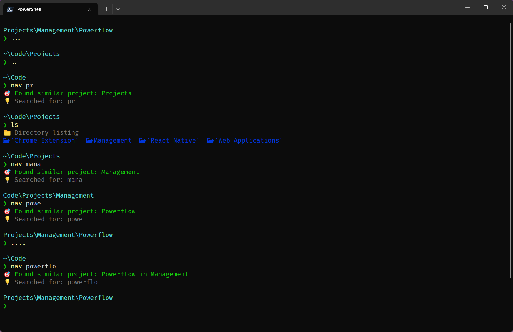
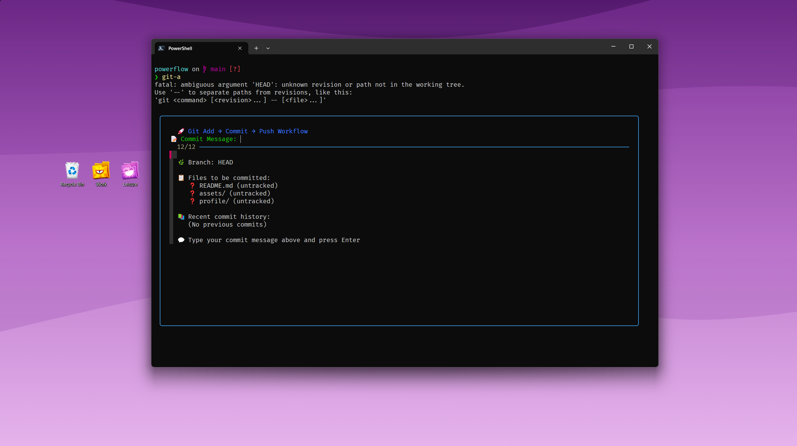
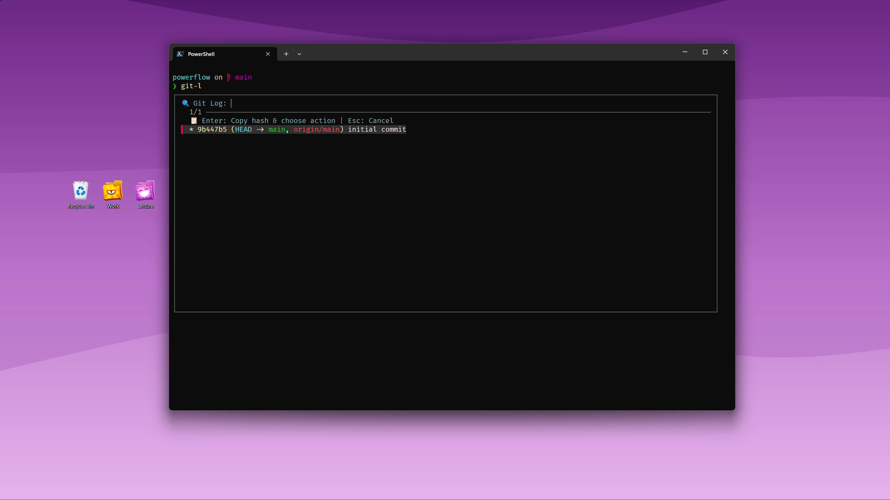

# 🚀 PowerFlow

> A beautiful, intelligent PowerShell profile that supercharges your terminal experience with smart navigation, enhanced Git workflows, and productivity-focused tools.

[](https://github.com/Syntax-Read3r/powerflow/releases)
[](https://github.com/PowerShell/PowerShell)
[](https://github.com/microsoft/terminal)
[](LICENSE)

## 🎬 Demo

<div align="center">

### See PowerFlow in Action!

<!-- Upload demo-video.mp4 to GitHub Issues to get the CDN link, then replace this line: -->
<!-- https://github.com/Syntax-Read3r/powerflow/assets/USER_ID/VIDEO_ID.mp4 -->



### Feature Screenshots

 

_🎥 **Full video demo**: Upload `assets/demo-video.mp4` to a GitHub issue to get the embeddable link_

</div>

## ✨ Features

### 🧭 Smart Navigation System

- **Intelligent Project Search**: `nav chess-guru` finds projects across multiple directories
- **Persistent Bookmarks**: Create, manage, and navigate to frequently used locations
- **Fuzzy Search Integration**: Beautiful fzf interfaces for everything
- **Context-Aware Navigation**: Adapts based on your current location

### 🎯 Enhanced Git Workflow

- **Beautiful Add-Commit-Push**: Interactive workflow with visual feedback
- **Repository-Based Versioning**: Auto-increment versions from git tags
- **Rollback System**: Create rollback branches from any commit safely
- **Interactive Branch Manager**: Pick, create, delete branches with visual interface
- **GitHub Integration**: Browse, clone, and manage your repositories with token security

### ✂️ File Operations That Speak Bash

- **Real GNU flags**: `rm -rf`, `mkdir -p a/b/c`, `touch -c`, `ls -la` — your muscle
  memory just works, on Windows too
- **Move or cut**: `mv old.txt new.txt` moves like bash; `mv filename` cuts, `mv-t` pastes
- **Interactive Rename**: Beautiful interface for renaming files
- **Safety Checks**: `rm <dir>` without `-r` refuses, like GNU — a typo'd path should
  not take a tree with it

### 🎓 It Teaches You Linux While You Use It

- **`lesson <command>` / `l <command>`**: learn any command — runs nothing, always safe.
  24 lessons across 7 topics, with tab-completion
- **Brother commands**: `changemode` → `chmod`, `findtext` → `grep`, `dirsize` → `du` and
  20 more — same flags, same result, and each prints the real command it ran
- **`perms <path>`**: file permissions with every column actually labelled
- **`linux-lessons full|hint|off`**: teaching is a phase, not a permanent state

### 🌐 Servers by Name, Not by IP

- **`srv proxmox`** connects using a saved alias without repeating its username, address, or
  port in the UI—including the password prompt and failed-authentication message
- **Alias-only live status**: bare `srv` and `srv list` show the saved name plus `✅ online`,
  `🟡 host up, ssh not answering`, or `⛔ offline · last seen Jul 17`
- **Authenticated details**: `srv proxmox info` authenticates first and reveals the stored
  endpoint only when authentication succeeds
- **Tested before saving**: `srv add` probes the SSH port first, catching typo'd IPs

> A short-lived platform helper displays `Password for 'proxmox':` and passes the hidden input
> directly to OpenSSH's askpass pipe. The password is never stored, logged, echoed, placed in an
> environment variable, or added to a process command line.

### 🖥️ Machine Health at a Glance

- **`pc-whoami`**: CPU, GPU, RAM spec, drives, free ports/slots, BIOS age, power plan,
  hardware errors — one screen, no hex, no GUIDs. Custom/OEM power plans get flagged
- **`pc-whoami --ram`**: a map of where your memory is, in five levels — `huge` `large`
  `medium` `small` `tiny`. Read-only, five rows instead of 167. Open one with `-ram huge`
- **`pc-whoami --ram java`**: that program's processes with **command lines**, so you can tell
  eight javas apart. Enter closes one process (confirm with its PID), ctrl-a closes the whole
  program (warned harder) — system-critical processes and your own shell are never killed
- **`pc-cap 85` / `pc-cap restore`**: cap CPU speed with **guaranteed restoration** —
  the prior state is recorded to disk before anything changes
- **`pc-name web-prod`**: rename the machine **and** sync `/etc/hosts` in the same step.
  Renaming alone leaves the resolver naming the old host, and every later `sudo` stalls on
  *"unable to resolve host"* — it still works, which is exactly why nobody traces it back.
  Previews both edits, backs the file up, and verifies the new name resolves
- **`storage report`**: `lsblk` + `fdisk -l` + `swapon --show` + `free -h` + `/etc/fstab` in
  one read-only view, and it never asks for a password
- **`--educate` on any command**: a plain-English footer explaining what you just looked at,
  printed *after* the data so an expert ignores it by not reading down
- **`team-room`**: every AI agent watcher on the machine, and whether it is actually
  **live** — then `team-room stop <name>` ends it. Previously you could only ask the agent
  to stop itself

### ⚡ Proxmox Without the Incantations (Linux)

- **`pmx`**: node, disks, ZFS pools, guests and pending updates on the host — one command
  instead of `pvesh` + `lsblk` + `smartctl` + `zpool` + `journalctl`
- **VM management from either side**: use local transport on Proxmox or a saved `srv` SSH
  alias from Windows/Linux for VM discovery, full clones, CPU/memory changes, disk growth,
  lifecycle actions, and snapshots
- **Private connection state**: unavailable password-only remote management shows the saved alias
  and directs you to `srv proxmox`; raw `user@host` SSH errors never reach the PMX dashboard
- **VM networking in human terms**: `pmx vm network`, `pmx vm nic`, and `pmx vm ip` separate
  configured adapters from addresses reported inside the VM; native Proxmox vocabulary stays
  hidden unless you ask for `--show-native`
- **`pmx net status`**: which VMs are running, what addresses their agents report, and which
  have SSH answering — one table instead of `qm list` plus one `qm guest cmd` per VM plus an
  ssh attempt each. It probes **only** addresses the guest agent reported: no ARP, no DNS
  guessing, no DHCP leases, no subnet sweep. `ready` means the TCP port answered, and says so
  — not that a login would succeed
- **Safe mutations**: every change previews, confirms in a real terminal, re-reads state,
  executes an allow-listed `qm` operation, verifies the result, and writes a secret-free audit
  record. `--dry-run` stops before execution
- **`pmx disk sdg report`**: *is this drive genuine?* Zero WWN, a generic model string, a
  six-digit serial, a drive that refuses SMART, a size that disagrees with itself, kernel
  I/O errors — each is evidence, and the report says which fired and what it means
- **`--write`** saves the whole bundle (report, raw SMART, kernel log, stable IDs) so a
  refund request is a file you attach, not a story you tell

### 🐳 Containers Without the Flags (`dkr` · `pman`)

- **`dkr` drives docker, `pman` drives podman** — one implementation, two entry points. The
  command *name* is the engine, so there is no `--engine` flag to remember and help text never
  becomes machine-dependent
- **One table, grouped by compose stack**, replacing
  `docker ps --format "table {{.Names}}\t{{.Status}}\t{{.Ports}}"`. Stopped containers are
  listed, not hidden
- **Mark several, act once**: with `fzf`, Tab marks containers and Enter picks one action for all
  of them — so stopping four becomes four keystrokes instead of four typed names
- **Names resolve from anywhere**: container → compose service → project → substring, so
  `dkr restart sonarr` works from any directory
- **`restart` is compose-correct** — a plain restart ignores an edited compose file, which is the
  classic "I changed the yml and nothing happened"
- **`down` can never reach `-v`**, so it cannot delete your named volumes
- **`pman stores`** shows every store a machine has. Podman keeps *rootless* and *rootful*
  containers in separate stores, so a container can be plainly running and still invisible —
  the engine answers truthfully that there are none *here*
- **Never a confident wrong answer**: when zero containers come back it re-probes engine health
  first, because podman can report a usable client version while the service is unreachable

### 🎨 Beautiful Interface

- **FiraCode Nerd Font Mono**: Auto-installed for single-cell icon display
- **Starship Prompt**: Cross-shell prompt with Git integration
- **Color-Coded Output**: Consistent visual feedback throughout
- **Auto-Update System**: Keeps PowerFlow current with latest features

### 🪟 Terminal Enhancement

- **Tab Management**: Create, switch, and close Windows Terminal tabs
- **Auto-Dependency Management**: Automatically installs required tools
- **Comprehensive Help**: Built-in documentation system
- **Performance Optimized**: Fast loading with smart caching

## 💻 Code Examples

```powershell
# Smart navigation - finds projects intelligently
nav my-react-app

# Enhanced Git workflow
git-a               # Beautiful add → commit → push interface
git-rl              # Interactive release: pick patch/minor/major, commit, tag, push

# Cut and paste files
mv important-file   # Cuts file
# Navigate to destination
mv-t               # Pastes file

# Interactive Git log
git-l              # Beautiful log viewer with actions

# GitHub repo browser
gh-l               # Browse your repos with activity stats

# Learn Linux as you go
l grep             # a lesson on grep — runs nothing, always safe
perms ward-a       # permissions with every column explained
changemode 775 dir # runs chmod 775, and tells you it did

# Machine health
pc-whoami          # CPU, GPU, RAM, drives, BIOS age, power, errors — one screen
pc-whoami --ram     # a map of where your RAM went, in five levels
pc-whoami --ram huge # open the level that matters — then drill in to close something

# Check for updates
powerflow-update   # Full-tree update via the real installer
```

## ⚡ Quick Installation

PowerFlow runs on **Windows and Linux** from one codebase.

### 🪟 Windows

```powershell
irm https://github.com/Syntax-Read3r/powerflow/releases/latest/download/install.ps1 | iex
```

### 🐧 Linux

```bash
# terminal — and start PowerFlow automatically on login
curl -fsSL https://github.com/Syntax-Read3r/powerflow/releases/latest/download/install.sh | bash -s -- --auto-login

# ...or a graphical installer (zenity / kdialog / yad)
curl -fsSL https://github.com/Syntax-Read3r/powerflow/releases/latest/download/install-gui.sh -o install-gui.sh
bash install-gui.sh
```

The Linux installer installs PowerShell if you don't have it (Debian, Ubuntu, Fedora,
Arch, openSUSE, Alpine), then PowerFlow, its dependencies, and a Nerd Font.

> #### ⚠️ On Linux, PowerFlow only loads when `pwsh` runs
>
> It is a PowerShell *profile*. Your login shell is normally bash, so after a reboot you
> land in bash and PowerFlow is **not there** — nothing is broken, you're just in a
> different shell. **`--auto-login`** (above) handles this by adding a guarded block to
> `~/.bashrc`. Already installed without it? Turn it on from inside PowerFlow — no
> re-install:
>
> ```
> pwsh-autologin          # start PowerFlow on login  (pwsh-autologin off to undo)
> ```
>
> The hook is guarded: if pwsh is ever removed or broken you still get bash, so you can't
> be locked out of your own server. Test it without logging out with `bash -l`.

> #### 🎨 If the prompt or `ls` shows boxes / Chinese characters
>
> That's a **missing Nerd Font** — Starship and lsd draw with special glyphs. The installer
> now installs one, but a font can only be *set* by you:
>
> ```
> pwsh-font          # install the font (if needed) and print the one terminal step
> ```
>
> Then set your terminal's font to **FiraCode Nerd Font Mono**. The Mono variant keeps
> lsd's icons from overlapping filenames.

### 🐧 Linux keeps its GNU coreutils

`rm`, `mv`, `cp`, `cat`, `grep` and friends stay the **real GNU tools** — PowerFlow never
shadows them. Its own versions are **`del`** and **`mvf`**.

### Prerequisites

| | |
|---|---|
| **Windows** | PowerShell 7.0+ · Windows 10/11 or Server 2016+ · Scoop (installed automatically if missing) |
| **Linux** | Any distro with apt / dnf / pacman / zypper / apk (PowerShell 7 is installed for you) |
| **Both** | Internet connection, for dependency installation |

**📖 [Complete Installation Guide](docs/installation.md)** · **[Upgrading from v2.x](docs/migration/v3-upgrade.md)**

## 🚀 What Happens After Installation?

PowerFlow automatically sets up your environment:

1. **🧰 Verifies the Windows prerequisite** - Scoop is installed automatically if missing
   and activated in the current shell; Linux uses the distro package manager
2. **🎨 Installs FiraCode Nerd Font Mono** - Scoop on Windows, direct download + `fc-cache`
   on Linux (re-run any time with `pwsh-font`)
3. **📦 Installs Dependencies** - Starship, fzf, zoxide, lsd (Scoop / your distro's
   package manager)
4. **🔖 Creates Default Bookmarks** - Quick access to common directories
5. **🔄 Enables Auto-Updates** - Stay current with latest features
6. **💡 Shows Setup Tips** - Points you at the one manual step: setting the terminal font

### Final Setup Step

**Configure Windows Terminal Font:**
1. Open Windows Terminal → Settings (`Ctrl+,`)
2. Go to your PowerShell profile → Appearance
3. Set **Font face** to `FiraCode Nerd Font Mono`
4. Restart terminal and enjoy! 🎉

## 🎯 Quick Start Guide

### Navigation Basics

```powershell
# Create bookmarks for frequent locations
nav cb work          # Bookmark current directory as 'work'
nav b work           # Navigate to 'work' bookmark
nav list             # Interactive bookmark manager

# Smart project navigation
nav my-project       # Finds project in ~/Code or bookmarked directories
nav .. src           # Go up one level, then into 'src' directory
```

### Git Workflow

```powershell
# Enhanced add-commit-push
git-a                # Interactive workflow with file preview
git-rl               # Interactive release: bump version, commit, tag, push

# Rollback system
git-rb abc123        # Create rollback branch from commit
git-rba              # Rollback branch workflow (only on rollback-* branches)

# Interactive tools
git-b                # Branch picker and manager
git-l                # Beautiful log viewer
git-s                # Interactive status viewer
```

### File Operations

```powershell
# Cut and paste workflow
mv myfile.txt        # Cut file (supports fuzzy search)
mv-t                 # Paste file in current directory
mv-c                 # Cancel move operation

# Smart rename
rn                   # Interactive file picker and rename
rn myfile.txt        # Direct rename with interface

# Enhanced listing
ls                   # Beautiful directory listing
ls --tree            # Tree view with smart depth
ls -t                # Sort by time (real GNU flag)
```

### GitHub Integration

```powershell
# Browse your repositories
gh-l                 # List repos with activity stats
gh-l 20              # Show top 20 repos

# Token management (automatic secure storage)
gh-l-status          # Check if token is saved
gh-l-reset           # Remove saved token
```

## 🔧 Version Control Setup

### Release Workflow

PowerFlow releases are managed through `git-rl` (`git-release`), an interactive fzf workflow that handles the full release pipeline in one command.

#### How It Works

```powershell
git-rl   # or: git-release
```

The workflow:
1. Reads the current version from `config/PowerFlow.settings.ps1`
2. Presents a bump-type selector (patch / minor / major / custom)
3. Prompts for a release description
4. Updates `config/PowerFlow.settings.ps1` to the new version
5. Runs `git add .`, commits **all working-tree changes**, pushes, creates the tag, and pushes
   the tag. Review `git status --short` first; this is not limited to files you staged earlier.

**Example Flow:**
- **Current**: `v2.0.1` + pick **patch** → **Next**: `v2.0.2`
- **Current**: `v2.0.1` + pick **minor** → **Next**: `v2.1.0`
- **Current**: `v2.0.1` + pick **major** → **Next**: `v3.0.0`

#### Setting Up Development Environment

For PowerFlow development and contributions:

```powershell
# 1. Fork and clone the repository
git clone https://github.com/your-username/powerflow.git
cd powerflow

# 2. Set up upstream remote
git remote add upstream https://github.com/Syntax-Read3r/powerflow.git

# 3. Create development branch
git checkout -b feature/your-feature-name

# 4. Make your changes and test
# Edit files in components/ — the profile is now a bootloader
# that dot-sources 28 component files under components/ and config/
# Test your changes thoroughly

# 5. Commit and push your changes
git-a                # Use PowerFlow's own workflow!

# 6. Create pull request to upstream
```

#### Version Release Workflow

For maintainers creating releases:

```powershell
# 1. Ensure you're on main branch with latest changes
git checkout main
git pull upstream main

# 2. Run the release workflow
git-rl              # fzf picker: choose patch/minor/major/custom

# This will:
# - Present a version bump selector
# - Update config/PowerFlow.settings.ps1 to the new version
# - Commit all changes with a versioned commit message
# - Push the commit to remote
# - Create and push the version tag (e.g., v2.0.2)
# - Trigger the GitHub Actions release pipeline
```

#### Manual Version Control

If you need to manage tags directly:

```powershell
# View tag history
git tag --list --sort=-version:refname

# Delete incorrect tags
git tag -d v2.0.0           # Delete locally
git push origin :v2.0.0     # Delete remotely
```

#### GitHub Actions Integration

PowerFlow includes automated release workflows:

- **🔍 Validation**: Checks profile syntax and version consistency
- **📦 Build**: Creates install scripts and release assets
- **🚀 Release**: Creates GitHub release with downloadable files
- **🔔 Notifications**: Updates auto-update system

**Release Process:**
1. Push version tag → Triggers workflow
2. Workflow validates and builds release
3. Creates GitHub release with install scripts
4. Users get auto-update notifications

#### Best Practices

**For Contributors:**
- Always test your changes thoroughly
- Use descriptive commit messages
- Create feature branches for new work
- Don't create version tags (maintainers only)

**For Maintainers:**
- Use `git-rl` for all version releases
- Update `CHANGELOG.md` before running `git-rl`
- Test the release workflow in development
- Monitor GitHub Actions for build status

**Version Tag Format:**
- ✅ `v1.0.0` - Semantic versioning with 'v' prefix
- ✅ `v1.2.3` - Major.Minor.Patch format
- ❌ `1.0.0` - Missing 'v' prefix
- ❌ `v1.0` - Incomplete version number

## 📚 Complete Feature Reference

### Smart Navigation & Bookmarks

| Command               | Description                              |
| --------------------- | ---------------------------------------- |
| `nav <project>`         | Smart project search with fuzzy matching |
| `nav -docs <name>`      | Search from a named starting point — see below |
| `nav -pics`             | Go straight there, no argument needed    |
| `nav b <bookmark>`      | Navigate to bookmark                     |
| `nav b .`               | Bookmark the directory you are in        |
| `nav --anchor . <name>` | Make **your own** starting point → `nav -<name>` |
| `nav anchors`           | Every starting point: built-in vs yours  |
| `nav anchors rm <name>` | Remove one you made (built-ins are protected) |
| `nav list`              | Interactive bookmark manager             |
| `nav roots`             | Where a bare `nav` searches, plus every starting point |
| `nav roots add /srv`    | Also search `/srv` (or `/opt`, `/mnt/data`, …) |
| `..`, `...`, `....`     | Quick parent directory navigation        |

**Starting points** save you typing a path. The same names work on Windows and Linux:

```
-home  -code  -documents  -downloads  -pictures  -videos  -music  -desktop  -config  -tmp
                                    Linux also:  -srv  -opt  -www  -etc  -log  -mnt
       shorthand:  -docs  -pics  -dl  -vids  -desk  -cfg
```

```bash
nav -srv downloads      # search /srv for it, then pick from the same fzf you already know
nav -pics screenshots   # your real Pictures folder — OneDrive-redirected or local, whichever it is
ls  -srv complete       # list it without cd'ing
```

`/dev`, `/proc`, `/sys` and `/run` are deliberately excluded — there is nothing in a
kernel-backed pseudo-filesystem to navigate to. On Windows the folders are read from the
**Known Folder registry**, so `-docs` finds your real Documents even when OneDrive has moved it;
`pwsh-config` → *User folders* switches to local paths and offers to create any that are missing.

### Enhanced Git Workflow

| Command           | Description                                          |
| ----------------- | ---------------------------------------------------- |
| `git-a`           | Beautiful add → commit → push workflow               |
| `git-rl`          | Interactive release: bump version, commit, tag, push. Reads any project's own version file — `package.json`, `pyproject.toml`, `Cargo.toml`, `*.csproj`, `build.gradle`, `VERSION` — and keeps several in sync. In a project **not yet set up** for releases it says so and points at `git-rl -h`, writing nothing |
| `git-rl -h`       | Set up `git-rl` in **another** project. Confirms you are in the right folder first, then writes the walkthrough to `docs/git-release-help.md` **in that project** and copies an AI setup prompt to your clipboard. With an assistant open in the repo there is nothing to paste — point it at the file |
| `git-rb <commit>` | Create rollback branch from commit                   |
| `git-rba`         | Rollback branch add-commit-push                      |

| `git-l`           | Interactive log viewer with actions                  |
| `git-b`           | Branch picker and manager                            |
| `git-s`           | Interactive status viewer                            |

### File Operations

Single dash is Linux's, long dash is PowerFlow's: `ls -t` sorts by time (GNU),
`ls --tree` is PowerFlow's tree view. **PowerFlow's delete and move are `del` and `mvf` on
every platform** — they are not clones of the GNU tools (`del` opens a picker and confirms;
`mvf` with one argument *cuts* rather than moves), so they carry their own names rather than
silently changing what `rm` and `mv` do. On **Windows**, where there is no GNU tool underneath,
`rm` and `mv` are also bound to them; on **Linux** those two names stay the real coreutils.
Whichever name you type is the one the messages use.

| Command              | Description                                        |
| -------------------- | -------------------------------------------------- |
| `mvf <src> <dst>`    | Move or rename, like bash (`-f` force, `-n` never overwrite) |
| `mvf <a> <b> <dir>/` | Move several files into a directory                |
| `mvf <file>`         | ✂️ Cut for moving (1 arg = cut, 2+ = move)          |
| `mv-t`               | Paste cut file                                     |
| `rn [file]`          | Interactive file rename                            |
| `rn <file> --chmod 600` | Rename and set the mode in one step — applied to the **new** path and verified by reading it back. A failed chmod never undoes the rename (Linux) |
| `ls --perms`         | A permission view: mode first in both notations, ⚠ only where earned (world-writable, setuid, setgid) |
| `del`                | fzf picker, then confirm before deleting           |
| `del -rf <dir>`      | Recursive force remove — bash muscle memory works  |
| `del *.log`          | Wildcard removal — lists every match, one confirm  |
| `ls -la` / `ls -t`   | Real GNU flags (list all / sort by time)           |
| `ls --tree`          | PowerFlow's tree view with smart depth             |

On Windows only — these three are GNU clones for a platform that ships none of them
(`windows-only/coreutils.ps1`). On Linux the real tools are better and are left alone:

| Command             | Description                                        |
| ------------------- | -------------------------------------------------- |
| `mkdir -p a/b/c`    | Create the whole chain                             |
| `touch -c <file>`   | Bump timestamp only if it exists — never truncates |
| `rmdir <dir>`       | Remove a directory; asks before taking contents    |

### Learn Linux While You Use It

| Command                | Description                                      |
| ---------------------- | ------------------------------------------------ |
| `lesson <command>`     | Learn any command — runs nothing, always safe    |
| `l grep` · `l rm`      | Shorthand; tab-completes commands and topics     |
| `lesson permissions`   | Every lesson in a topic (7 topics, 24 lessons)   |
| `perms <path>`         | Permissions with every column labelled           |
| `changemode 775 <dir>` | Brother of `chmod` — same flags, teaches the real command |
| `dirsize -sh *`        | Brother of `du` (also: `diskfree`, `listports`, `systemlogs`, …) |
| `defaultmode 022`      | The umask, with what it actually produces        |
| `linux-lessons off`    | Hide the teaching (`full` · `hint` · `off`)      |

### Machine Health

| Command              | Description                                       |
| -------------------- | ------------------------------------------------- |
| `pc-whoami`          | Vitals: power plan, CPU cap, HW errors, BIOS age  |
| `pc-whoami --power`   | Every power plan, caps decoded — no hex, no GUIDs |
| `pc-whoami --crashes` | Hardware errors, bugchecks, dumps (`-export` bundles the evidence) |
| `pc-whoami --bios`    | Firmware version, age, board model                |
| `pc-whoami --ram`     | The map: how much memory sits in each level (read-only) |
| `pc-whoami --ram huge`| One level: `huge` · `large` · `medium` · `small` · `tiny` (`-min N` for a custom cut-off) |
| `pc-whoami --ram java`| That program's processes with **command lines** — Enter closes one, ctrl-a closes all |
| `pc-cap 85`          | Cap CPU speed — prior state recorded for safe undo |
| `pc-whoami --system` | What this machine IS: hostname, OS, kernel, arch, virtualisation, container, model |
| `pc-whoami --storage`| Volumes, memory, swap and disk layout in one read-only view |
| `pc-name <new-name>` | Rename this machine **and** keep `/etc/hosts` in step, so `sudo` does not start stalling. Previews both edits, backs the file up, verifies the name resolves |
| `storage report`     | One read-only view instead of `lsblk` + `fdisk -l` + `swapon` + `free` + `cat /etc/fstab` — and no sudo |
| `<any command> --educate` | A plain-English footer explaining what you just looked at. Opt-in, printed after the data, so an expert ignores it by not reading down |
| `pc-cap restore`     | Put back exactly what was recorded                |
| `team-room`          | Every agent watcher on this machine — which are **live**, and stop them |
| `team-room stop <name>` | Stop a room: disarm it and end its watcher process |
| `team-room start <name>`| Re-arm a room you previously set up (arm is boot-scoped) |

### Proxmox VE

`pmx` is one command for the things you otherwise reach for `pvesh`, `lsblk`, `smartctl`,
`zpool`, `journalctl` and `qm` to answer. Host and physical-disk inspection runs locally on a
Proxmox node. VM management can run there too, or over SSH from Windows/Linux through a saved
`srv` alias. PMX stores the alias and policy settings, never an SSH key or password.

| Command                  | Description                                     |
| ------------------------ | ----------------------------------------------- |
| `pmx`                    | Node dashboard: uptime, load, memory, storage, guests, updates |
| `pmx config set host <srv-alias>` | Select a saved SSH target; use `pmx config validate` to test it |
| `pmx discover` / `pmx node status` / `pmx storage list` | Discover nodes, bridges, VM storage, templates and capacity |
| `pmx list` / `pmx vm list` | Read VM inventory (`pmx list` is the `qm list` spelling) |
| `pmx status`             | The node dashboard, same view as `pmx node status` |
| `pmx net status`         | **Which VMs can I actually get into:** state, agent, address and SSH per VM. Probes only agent-reported addresses — never scans — and `ready` means the TCP port answered, not that a login would succeed |
| `pmx net <vm> status`    | The same for one VM, with every interface listed |
| `pmx vm next-id`         | The authoritative next free VMID |
| `pmx vm show <vm>` / `pmx vm status <vm>` | Inspect one VM by name or VMID |
| `pmx vm network <vm>` / `pmx vm net <vm>` | Combine configured adapters, VM-reported addresses, agent state, and an inferred primary candidate |
| `pmx vm network adapters <vm>` / `pmx vm nic <vm>` | Show virtual adapter model, bridge, MAC, firewall, VLAN, and link configuration |
| `pmx vm network addresses <vm>` / `pmx vm ip <vm>` | Show addresses reported from inside a running VM; use `-4` or `-6` to filter |
| `pmx vm network stats <vm>` / `pmx vm net stats <vm>` | Show exact receive/transmit counters reported by the VM agent |
| `pmx vm network list` / `pmx vm net list` | Summarize adapters, addresses, and agent state across QEMU VMs |
| `pmx vm clone --source <vm> --new-vmid auto --name <name> --dry-run` | Preview a full clone with per-disk storage placement and capacity |
| `pmx vm cpu set <vm> --cores <number>` | Guarded CPU allocation change |
| `pmx vm memory set <vm> --size <size>` | Guarded memory allocation change |
| `pmx disk list --vm <vm>` | List IEC size, boot/data role, storage, and backing identity |
| `pmx disk grow <vm> <size>` | Grow automatically only when exactly one eligible disk exists |
| `pmx disk grow <vm> <slot> <size>` | Grow an explicitly selected disk to a final size; never shrink |
| `pmx disk grow --vm <vm> --disk <slot> --to <size>` | Script-friendly explicit disk growth |
| `pmx vm start <vm>` / `pmx vm shutdown <vm>` | Guarded start and graceful shutdown |
| `pmx snapshot list --vm <vm>` / `pmx snapshot create --vm <vm> --name <name>` | Inspect and create named VM snapshots |
| `pmx disks`              | Every physical disk — model, size, SSD/HDD, what is using it |
| `pmx disk sdg`           | One disk in full: stable IDs, SMART, and what would be destroyed |
| `pmx disk sdg smart`     | The SMART report, decoded                       |
| `pmx disk sdg report`    | **Is this drive genuine?** Evidence-based authenticity + health verdict |
| `pmx disk sdg report --write` | Save the evidence bundle (report, raw SMART, kernel log, IDs) for an RMA |
| `pmx pools` / `pmx guests` / `pmx updates` | ZFS pools · VMs and containers · pending updates |

Run `pmx help` for the full surface or a topic such as `pmx help vm network`. Mutations accept
`--dry-run` and `--show-native`; network reads also accept `-j`/`-t` and address-family
shortcuts `-4`/`-6` where documented.
Commands already under `pmx vm` take the VM name or VMID directly; `--vm` is reserved for
cross-resource commands such as `pmx disk` and `pmx snapshot`.

PMX uses `KiB`/`MiB`/`GiB`/`TiB` for binary sizes. Resize arithmetic always uses exact
configured bytes, never the decorative table. If a VM has multiple eligible disks, the concise
growth form lists them and stops; it never guesses which disk is the system disk.

### Appearance & Login

| Command                | Description                                              |
| ---------------------- | ------------------------------------------------------- |
| `pwsh-font`            | Install the Nerd Font, then show the terminal-font step  |
| `pwsh-font --status`    | Is the font installed? (installs nothing)                |
| `pwsh-autologin`       | Start PowerFlow on login — no installer re-run (Linux)   |
| `pwsh-autologin off`   | Stop starting on login                                   |
| `pwsh-exit`            | Drop to bash without closing your SSH session (Linux)    |
| `pwsh-config`          | Menu that **applies** OS settings: timezone, locale, hostname, time-sync (+ keyboard on Linux) |
| `start-folder`         | Manage what runs at login — Enter toggles, ctrl-d deletes (alias `startup`) |

### System

| Command                  | Description                                     |
| ------------------------ | ----------------------------------------------- |
| `shutdown 1h 30m`        | Schedule a shutdown (10 min – 6 hr range)        |
| `shutdown cancel` / `s c`| Cancel a scheduled shutdown                     |
| `set-path <dir>`         | Add a directory to the User PATH (no quotes)     |
| `set-path --system <dir>` | Add to the System PATH (requires Administrator)  |

### Containers

`dkr` is docker, `pman` is podman. Every verb below works with either name.

| Command             | Description                                                  |
| ------------------- | ------------------------------------------------------------ |
| `dkr`               | Every container, grouped by stack; fzf multi-select to act    |
| `dkr logs [name]`   | Tail a log — `-f` follows, no name opens a picker             |
| `dkr shell [name]`  | Shell in: `bash` if the image has it, else `sh`               |
| `dkr up [stack]`    | Bring a compose stack up (works when nothing is running)      |
| `dkr down [stack]`  | Take it down — confirms, and keeps named volumes              |
| `dkr restart <name>`| Compose-correct restart, from any directory                   |
| `dkr stop` / `start`| No name opens a multi-select picker                           |
| `pman stores`       | Every store this engine sees, and where containers really are |

### Disk Reclaim

Nothing below **1 GB** is ever listed, and a query **cannot span two size bands** —
an unreviewable list in front of a delete action is how people destroy things.

| Command                  | Description                                             |
| ------------------------ | ------------------------------------------------------- |
| `installed-apps -o`      | Overview of every size band, then drill into one         |
| `installed-apps`         | Pick a size band, then browse installed apps             |
| `installed-apps 2gb-4gb` | Apps in a range (must fit inside a single band)          |
| `disk-big`               | Large **folders and files** (vhdx, node_modules, caches) |
| `disk-big 50gb-200gb`    | The biggest offenders on disk                            |
| `disk-big --path D:\`    | Scan a specific location instead of the usual hot spots  |

Bands: `1–5 GB` · `5–20 GB` · `20–50 GB` · `50 GB+`.
Each row shows **size and age** — big *and* old is the strongest reclaim signal.
Actions: open folder · copy path · **uninstall properly** · Recycle Bin · permanent delete.
Protected system paths are refused outright, and virtual disks (`.vhdx`/`.vmdk`) warn that
deleting them destroys every container and volume inside.

### Version Management

| Command              | Description                      |
| -------------------- | -------------------------------- |
| `powerflow-version`  | Show PowerFlow version info      |
| `powerflow-update`   | Full-tree update via the real installer |
| `Get-PowerFlowVersion` | Detailed version information   |

On startup, PowerFlow checks for updates once a day (via the `releases/latest`
redirect — no API quota) and offers: **install now · remind me tomorrow · snooze a
week · turn off**. Piped/non-interactive shells get one quiet line, never a prompt.

### Terminal Management

| Command             | Description                   |
| ------------------- | ----------------------------- |
| `open-nt`           | Open new Windows Terminal tab |
| `next-t` / `prev-t` | Switch between tabs           |
| `open-t <N>`        | Switch to specific tab        |

### Configuration

| Command         | Description                    |
| --------------- | ------------------------------ |
| `pwsh-profile`  | Edit PowerShell profile        |
| `pwsh-starship` | Edit Starship config           |
| `pwsh-settings` | Edit Windows Terminal settings |
| `pwsh-h`        | The command manual — grouped, scroll to read (`pwsh-h -a` for the fzf browser, `pwsh-h git` filters) |
| `pwsh-help`     | Long alias for `pwsh-h` (`pwsh-help --advanced` = `pwsh-h -a`) |

## 🔧 Configuration

### Auto-Installed Dependencies

On Windows, **Scoop is a PowerFlow prerequisite** and is installed automatically when missing.
Its shim is activated immediately so the same run can install:

- **Starship**: Cross-shell prompt with Git integration
- **fzf**: Fuzzy finder for interactive selection
- **zoxide**: Smart directory navigation with learning
- **lsd**: Modern ls replacement with icons
- **git**: Version control system
- **FiraCode Nerd Font Mono**: Single-cell prompt and file-list glyphs

Uninstall keeps Scoop by default, even with `-Yes`. An interactive uninstall asks separately
whether to remove it; answering yes first explains that Scoop removal affects every
Scoop-managed application, bucket and shim, then Scoop asks for final confirmation.

### Customization

```powershell
pwsh-profile  # Opens profile in VS Code for editing
```

### Disable Features

Edit `config/PowerFlow.settings.ps1` and set any of these flags to `$false`:

```powershell
$script:CHECK_DEPENDENCIES = $false    # Skip dependency checks
$script:CHECK_UPDATES = $false         # Skip PowerShell update checks  
$script:CHECK_PROFILE_UPDATES = $false # Skip PowerFlow update checks
```

## 🔄 Auto-Update System

PowerFlow includes intelligent update management:

- **Daily Update Checks** - Respectful, once-per-day maximum
- **Version Notifications** - Beautiful interface when updates available
- **One-Click Updates** - Automatic backup and update process
- **Rollback Safety** - Easy recovery if issues occur

```powershell
# Manual update commands
powerflow-update        # Force check for updates
powerflow-version       # Show current version info
```

## 🛡️ Safety Features

- **Automatic Backups**: Profile backed up before updates
- **Current Branch Protection**: Prevents deletion of active Git branches
- **Confirmation Prompts**: For destructive operations like file deletion
- **Path Validation**: Ensures operations target valid locations
- **Error Handling**: Graceful handling of missing dependencies
- **Corporate-Friendly**: Works in restricted environments

## 📖 Documentation

- **📦 [Installation Guide](docs/installation.md)** - Complete setup instructions
- **🚨 [Troubleshooting](docs/troubleshooting.md)** - Fix common issues quickly  
- **🎯 [Features Guide](docs/features.md)** - Detailed feature documentation
- **💡 [Contributing](CONTRIBUTING.md)** - How to contribute to PowerFlow

## 🆘 Need Help?

### Quick Self-Help

```powershell
pwsh-h              # The command manual — grouped, scroll to read
pwsh-h -a           # Searchable fzf browser · pwsh-h git filters a section
powerflow-version   # Version and status info
Get-Command starship, fzf, zoxide, lsd, git  # Check dependencies
```

### Common Issues

**Icons show as squares?** → Run `pwsh-font`, then select FiraCode Nerd Font Mono in Windows Terminal
**Commands not found?** → Run PowerShell as Administrator for first setup  
**Profile won't load?** → Check execution policy: `Set-ExecutionPolicy RemoteSigned -Scope CurrentUser`

**🚨 [Full Troubleshooting Guide](docs/troubleshooting.md)** - Solutions for all common problems

### Community Support

- **🐛 [Report Issues](https://github.com/Syntax-Read3r/powerflow/issues)** - Bug reports and feature requests
- **💬 [Discussions](https://github.com/Syntax-Read3r/powerflow/discussions)** - General questions and community chat
- **📚 [Documentation](docs/)** - Complete guides and references

## 🤝 Contributing

Contributions are welcome! PowerFlow is community-driven and benefits from diverse perspectives.

### Quick Contributing Guide

1. **Fork the repository** and create a feature branch
2. **Make your changes** with clear, well-commented code  
3. **Test thoroughly** on different Windows/PowerShell versions
4. **Update documentation** if needed
5. **Submit a pull request** with a clear description

### Areas for Contribution

- 🚀 Additional Git workflow improvements
- 📁 More file operation enhancements  
- 🌐 Cross-platform compatibility
- ⚡ Performance optimizations
- 🔧 New navigation features
- 📖 Documentation improvements
- 🎨 UI/UX enhancements

**📄 [Contributing Guidelines](CONTRIBUTING.md)** - Detailed contribution instructions

## 🚀 Releases & Updates

PowerFlow uses semantic versioning and automated releases:

- **🏷️ [Latest Release](https://github.com/Syntax-Read3r/powerflow/releases/latest)** - Current stable version
- **📋 [All Releases](https://github.com/Syntax-Read3r/powerflow/releases)** - Complete version history  
- **📝 [Changelog](CHANGELOG.md)** - Detailed changes by version
- **🔔 Auto-Updates** - Get notified of new versions automatically

## 📄 License

PowerFlow is licensed under the [MIT License](LICENSE) - see the LICENSE file for details.

### What this means:
- ✅ **Use** - Personal, commercial, any purpose
- ✅ **Modify** - Change the code however you want  
- ✅ **Distribute** - Share your modifications
- ✅ **Private Use** - Use in private/internal projects
- ℹ️ **Attribution** - Keep the license notice (that's it!)

## 🙏 Acknowledgments

PowerFlow builds on amazing open-source projects:

- **[Starship](https://starship.rs/)** - Beautiful cross-shell prompt
- **[fzf](https://github.com/junegunn/fzf)** - Amazing fuzzy finding capabilities
- **[zoxide](https://github.com/ajeetdsouza/zoxide)** - Smart directory navigation
- **[lsd](https://github.com/Peltoche/lsd)** - Modern file listing with icons
- **[Windows Terminal](https://github.com/microsoft/terminal)** - Excellent terminal experience
- **[PowerShell](https://github.com/PowerShell/PowerShell)** - Powerful cross-platform shell

## 🌟 Star History

[](https://star-history.com/#Syntax-Read3r/powerflow&Date)

---

<div align="center">
  <strong>Made with ❤️ for the PowerShell community</strong>
  <br>
  <sub>If PowerFlow improves your workflow, consider giving it a ⭐!</sub>
  <br><br>
  
  **🚀 Ready to supercharge your terminal?**
  
  ```powershell
  irm https://raw.githubusercontent.com/Syntax-Read3r/powerflow/main/install.ps1 | iex
  ```
</div>
